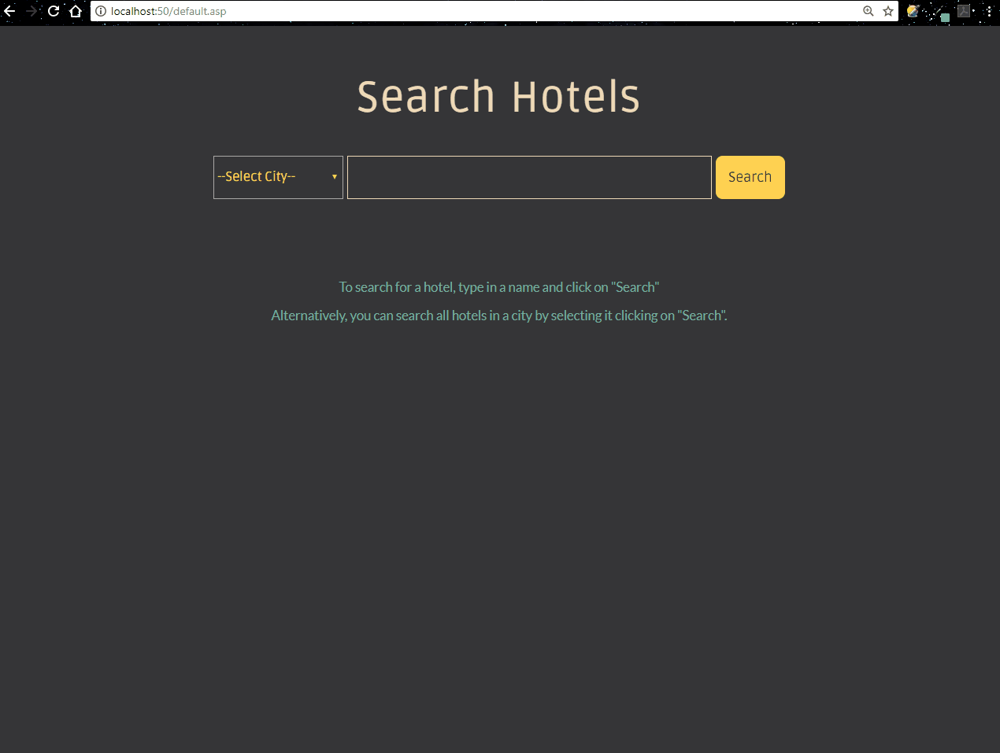

# A Classic ASP Example

### Making a simple hotel search system using VBScript
The server-side code is written in VBScript, the database engine used is SQL Server Express and a backup of the database is included in the repo as a .bak file. Place this file in the backup of your database engine and you will have the tables ready. 

Host the code in IIS to run it.

### Preview
Here's as to what the web page should looks like after it is hosted.  

